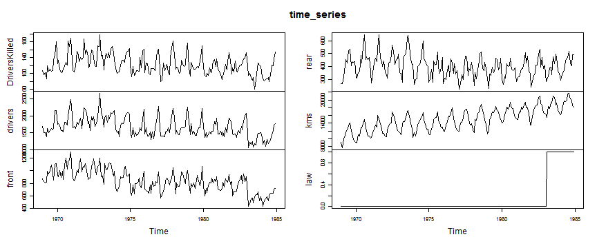
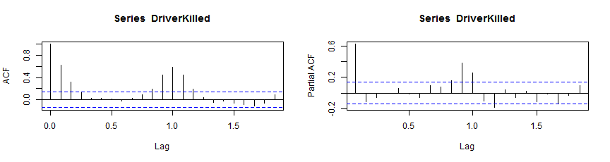

## Observation from dataset    
- [Seatbelts](http://stat.ethz.ch/R-manual/R-patched/library/datasets/html/UKDriverDeaths.html) gives the monthly totals of car drivers in Great Britain killed or seriously injured Jan 1969 to Dec 1984. Compulsory wearing of seat belts was introduced on 31 Jan 1983.  
- Seasonal variation:show one year periodicity.     
- Long term variability:decrease step-wise and largely decrease at 1983(law introduction). 
- Should normalized by kms(distance driven):increase thorughout the survey period.


--- .class #id 

## Machine learning model

-  one year periodicity confirmed by auto-covariance/correlation, so use AutoRegressive model


```
## 
## Call:
## arima(x = beforelaw, order = c(1, 0, 0), seasonal = list(order = c(1, 0, 0)))
## 
## Coefficients:
##         ar1   sar1  intercept
##       0.391  0.717      9.021
## s.e.  0.094  0.071      0.565
## 
## sigma^2 estimated as 2.19:  log likelihood = -310.4,  aic = 628.9
```

--- .class #id   

## Interactive report : please run it in the next page!

- Show multiple results in one page:react to the selected radio button(DriverKilled/drivers/front/rear), draw time series plot of survey data(1969-1984) and predicted data with -2se, +2se(1983 to 1984).
- Control model parameter:react to the selected slider(period for machine learning),calculate prediction and figure out the difference between survey and predicted data after law introduction. This feature is helpful to see how much long term variability(step-wise decrements) affects the difference.   
  
## Conclusion

- For three numbers;DriverKilled/drivers/front/, the result shows that compulsory wearing of seat belts decreased fatal accidents in Great Britain. The ratio of the difference between survey and prediction to prediction is under -20% and survey data locates near -2se.
- For rear number, the ratio is -10% to +1%, but survey data locates between mean prediction and -2se. So, the law doesn't have an effect on fatal accidents decrements.  

--- .class #id 

<iframe src="http://mmasuda.shinyapps.io/Seatbelts/"></iframe>

